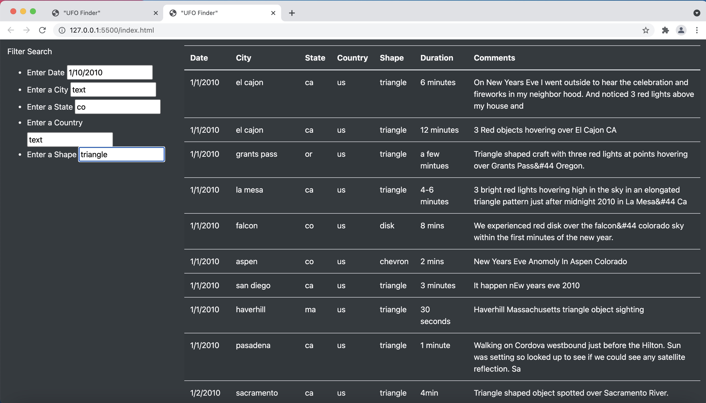

# UFOs
UCB Module Challenge: Use Java Script, HTML and CSS to create a custom webpage that showcases different UFO sightings around the world.

# Overview of the Analysis

We were given the task of improving the webpage by adding more search criteria, aside from the date, which already existed on the page. We were able to do this by modifying the JavaScript and adding table filters on the HTML for the city, state, country and shape. The purpose of these additions is to help users come up with more in-depth analysis of UFO sightings. 

# Results

The image below is how the finished webpage looks like. 

To initiate a search, type in the information for the specific criteria/fields you want to start looking into. For example - A state and the shape of the UFO. After entering the information in the appropiate field(s), press enter or return on your keyboard, HOWEVER if there are more fields that need to be completed, press enter or return after the last information has been entered. There are two possible search results based on what filters were written into the JavaScript of the HTML for the page.

## Search results with ALL searched values appearing on the SAME row ONLY.

 In this example we are looking for fireball shaped UFO's that appeared in ca(California).

This is the block of code used to yield search results if the user only wants rows where all the values they typed in the     search field(s) appear in the same row. It is currently the one in use on the JavaScript referenced on the HTML of the page and can be found in lines 67-76.     

## Search results showing ALL rows with ANY of the searched values.

The example below uses a different block of code than the one shown above. When we type in fireball for UFO shape and co-Colarado for the state, the search results would show ALL rows with "triangle" and "co" present in them, regardless of whether they exist in the same row or not.

This is the block of code on the JavaScript of the page's HTML that yielded the results above. It is found in lines 79-86 and is currently "commented out".

# Summary

## Drawback of This Webpage
At first glance and if not familiar with how to search for information on the page, the user might assume that all search fields might need to be filled up or completed in order to start a search. If the page was currently in use ---meaning, in this decade 2020's--- , even with the different table filters up, I think it WON'T be considered user-friendly; A user today might think that there are too many things/steps that need to be done to start or restart a search.

If the page was to remain the same, meaning without changing any of the code on the JS, a simple change of "Search by" instead of "Enter date(etc..)" on the HTML table filters would be helpful for a person new to the page. 

## Additional Recommendations for Further Development

* Instead of the user deleting what they have typed on the each field or criteria, a "clear all" button for all the search fields or for each specific search field or criteria would be helpful. The same would be true for a "search" button, which would initiate the search.
  
* Having an additional button that reloads or refreshes the page would also be a helpful tool for the user to have instead of hitting the reload button on top of the page if they want to start a new search
